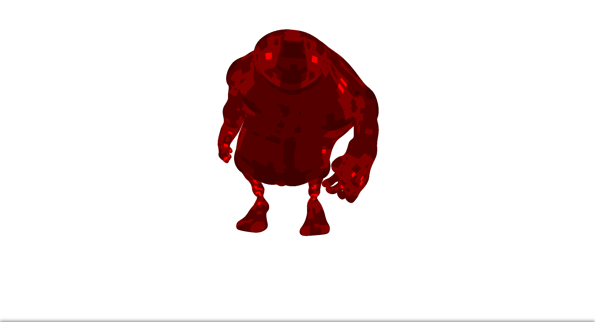

# view-dependent-rendering-coursework
Based on Christian Eisenacher/Carles Loop/Quirin Meyer article: [Real-Time View-Dependent Rendering of Parametric Surfaces](https://dl.acm.org/citation.cfm?id=1507172)

In computer graphics, the most common representation of smooth surfaces is parametric patches such as NURBS, Bezier, etc. It allowed representing smooth surfaces which can not be given mathematically by the set of smooth patches. This patches can be approximated by a polygonal mesh in render time which are primitive for opengl/directx. When approximation is made as preprocessing you get a static model. For low tessellated model from near distance, you will see artifacts of polygonal representation, for high tesselated model you will waste more performance of rendering to do unnecessary work when you observe it from far distance. Also, a high tessellated model uses many memories and wastes GPU bandwidth capacity.
Simple decision is to make patch tessellation based on a projection of this patch into screen space. 

So the main idea of algorithm (for Bezier 4x4 patches):
1. Projection patch to clip space (using MVP matrix)
2. Approximate patch with quad (or 9 quads or 18 triangles).
3. If distance between each control point of patch is less than threshold then we just render quad.
4. Else we subdivide patch into 4 patches and apply algorithm recursively.

Noticed that this algorithm can be easily paralleled. We can use 1 cuda-thread per 1 patch, but if we will make many independent operations on each control point we can use 16 threads per patch (as done in this project). These operations include: backface culling test, occlusion culling of bezier patch, subdivision of bezier patch, etc. Notice, that
we do not need to synchronize threads because 2 patches completely lie in one Cuda warp.

Problems that we not covered in the article and we solved here:
1. Parallesation subdivision of bezier patches (De Casteljau's algorithm in matrix form for 4x4 patches).
2. Problem of lost pixels because of real numbers precision (were solved by extent of patch bounds in screen space by 0.5 sizes of pixel).
3. Same problem as above but for depth buffer (we are using [logarithmic depth buffer](http://outerra.blogspot.ru/2013/07/logarithmic-depth-buffer-optimizations.html))
4. Realization of occlusion culling
5. Something else I didnt remember

For more information/images/tests please read [РПЗ.pdf](https://github.com/sargarass/view-dependent-rendering-coursework/blob/master/%D0%A0%D0%9F%D0%97.pdf)(in russian).
# System Requirements:
NVIDIA GPU with 256vram
cuda compute capability 2.0
opengl 3.3 support with extensions: GL_EXT_direct_state_access, GL_NV_framebuffer_multisample_coverage. 

Compiler: gcc

OS: Linux

RAM: 1GB

# Libraries that were used:
1. GLFW
2. GLEW
3. GLM
4. CUB

# How to build
1. cmake CMakeList.txt
2. make

# How to run
In the *bin* folder run application *VDRender*

# Controls
- "↑", "↓" - model choosing
- "LAlt" - type of antialiasing: None, MSAA, CSAA
- "[","]" - increase or decrease antialiasing.
- "С" - add current camera to cameres list and save it on disk.
- "X" - load cameres list from disk.
- "←", "→" - switch between cameres in cameres list.
- "F1" - turn on/off console debug info.
- "P" - pause/unpause rendering
- "B" - save current settings
- "V" - load last saved settings

# Cache tuning
In the file *Application.cpp* you can change cache size in vram and ram.

These caches are used to fast allocation temporary memories for operation (stack allocators).
```C++
    SystemManager::getInstance()->stackAllocator.resize(512UL * 1024UL * 1024UL);
    SystemManager::getInstance()->vdRender.init(256UL * 1024UL * 1024UL);
```
# Results
On those images, you can see polygons that are close to camera have the smallest size, also you can notice that smooth parts of the model took more tessellation passes. The parts which can be safely approximated without losing smoothes took fewer tesselation passes.


On this image, you can observe that different areas are coloured in different levels of red color. The darker area the more tessellation passes it took.

